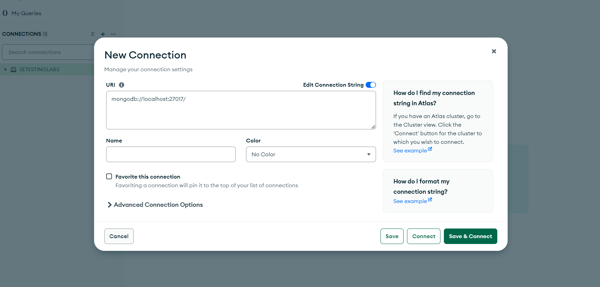
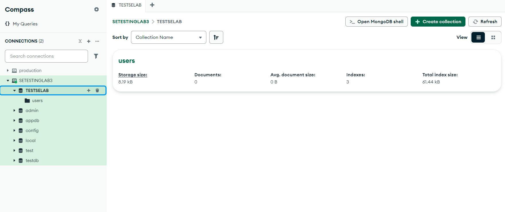

# Originally developed by

HasancanCakicioglu @ Github.com
the original repository link:
https://github.com/HasancanCakicioglu/mern-auth-backend.git

# Notes

Used for testing by Legayada, Surilla only for academic purposes and not for profit. Under the MIT License. This program is a BACKEND Application and has no FrontEnd, all testing done is mainly for the Backend using Supertest and Jest.

# Prerequisites:

please have mongodb shell installed on your device:

MongoDB Community Server
This is the core software needed to set up and run MongoDB databases locally.

Installation Steps:

1. Download MongoDB Community Server from the MongoDB Downloads Page.

2. Choose the correct version for your operating system (Windows, macOS, or Linux).

3. Follow the installation guide provided for your operating system.

Once installed, MongoDB will run as a service or daemon, and the default connection URI will be mongodb://localhost:27017.

if you don't have the shell:
install it from here:
https://www.mongodb.com/try/download/shell

```cmd
mongosh --version
```

or check that the MongoDB service is running in servinces (Windows)

# Full Installation Guide

````view link here:
https://www.mongodb.com/docs/manual/tutorial/install-mongodb-on-windows/#std-label-install-mdb-community-windows

# Installation

1. Clone the repository

```bash
git clone https://github.com/itsantonle/SETESTINGLAB3LEGAYADASURILLA.git
````

2. Set up the environment variables (sample .env below)

by default the server runs on localhost://3009

```txt
TEST_MONGODB_URI=
PROD_MONGODB_URI=
JWT_SECRET=
PORT=
```

example .env

```bash
TEST_MONGODB_URI=mongodb://localhost:27017/testdb
PROD_MONGODB_URI=mongodb://localhost:27017/proddb
JWT_SECRET=<GENERATED>
PORT=3008
```

3. Get a MongoDB URI:

Local (via bash or cmd)

start the mongodb service (automatic if installed)

```bash
mongod
```

this runs on on mongodb://localhost:27017 so the default URI is

```bash
mongodb://localhost:27017/<name-of-database>

```

Local (via MongoDB Compass)

download MongoDB compass
[MongoDB Compass Official Download Page](https://www.mongodb.com/try/download/compass)

Open MongoDB Compass and click to add a new connection:


Copy your URI to your .env file

4. The JWT Secret can be generated or you can just write it(NOT RECOMMENDED)
   [GENERATE JWT SECRET](https://jwtsecret.com/generate)

5. Run the tests

listens to port 3009 by default

```bash
npm run test
```

6. See the DB on MongoDBCompass
   

Local (via Mongosh - MongoDBShell) 7. all dbs run by

```bash
mongodb://localhost:27017/
```

8. MongoDB creates a database if it doesn't already exist

this creates a db called 'testDB'

```bash
Mongo_URI = mongodb://localhost:27017/testDB
```

9. example .env

```bash
TEST_MONGODB_URI=mongodb://localhost:27017/testDB
PROD_MONGODB_URI=mongodb://localhost:27017/ProdDB
JWT_SECRET=<GENERATED>
PORT=3008
```

10. Navigate to cmd or any terminal and run mongosh

```bash
mongosh
```

then once inside the shell enter:

```bash
show dbs
```

to navigate inside your db:

```bash
use <dbname>
```

to check the users collection that the tests automatically made in the db:
navigate to the db

```bash
use <dbname>
```

show the collections - you should see the users collection

```bash
show collections
```

while inside your db - type the command to check if the contents of that collection

```bash
db.users.find()
```

it should return nothing if the clean up test is ran

# Testing

The testing commands are found in package.json scripts

```js
"scripts": {
    "dev": "cross-env NODE_ENV=test nodemon api/index.js",
    "start": "cross-env NODE_ENV=production node api/index.js",
    "build": "npm install && npm install --prefix client && npm run build --prefix client",
    "test": "cross-env NODE_ENV=test npx jest",
    "test:watch": "npm test -- --watch"
  }
```

1. to run test suite (runs only once using the test db)

```bash
npm run test
```

2. The test suite will only ever run on the test db and never the production db

# THe tests file are ran inside the **_tests_** folder

```bash
users.test.js
```

# MERN Authentication Backend Project

This project is a nodejs backend built for MERN (MongoDB, Express.js, React.js, Node.js) stack. It provides user authentication functionality, allowing users to sign up, sign in, and access protected routes using JSON Web Tokens (JWT).

## Features

- User registration (Sign Up)
- User authentication (Sign In)
- Access control with JWT
- Protected routes for authenticated users
- Password hashing with bcrypt.js
- MongoDB database integration with Mongoose ODM

## Technologies Used

- MongoDB: A NoSQL database for storing user data.
- Express.js: A backend web application framework for Node.js.
- Node.js: A JavaScript runtime environment for executing server-side code.
- JWT (JSON Web Tokens): A compact, URL-safe means of representing claims to be transferred between two parties.
- bcrypt.js: A library to help hash passwords securely.

## License

This project is licensed under the [MIT License](LICENSE).

## Acknowledgements

- [MongoDB](https://www.mongodb.com/)
- [Express.js](https://expressjs.com/)
- [Node.js](https://nodejs.org/)
- [jsonwebtoken](https://www.npmjs.com/package/jsonwebtoken)
- [bcrypt.js](https://www.npmjs.com/package/bcryptjs)
